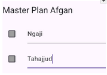

# Praktikum 1: Dasar State dengan Model-View – Flutter

## Deskripsi
Praktikum ini bertujuan untuk memahami **konsep state dalam Flutter**, dengan menerapkan arsitektur **Model–View** pada aplikasi sederhana bernama **Master Plan**.  
Aplikasi ini memungkinkan pengguna untuk:
- Menambahkan daftar rencana/tugas,
- Mengubah deskripsi tugas,
- Menandai tugas yang sudah selesai,
- Melihat daftar tugas dalam bentuk list yang dapat discroll.

---

## Struktur Folder Proyek

```
master_plan/
│
├── lib/
│   ├── main.dart
│   ├── models/
│   │   ├── task.dart
│   │   ├── plan.dart
│   │   └── data_layer.dart
│   └── views/
│       └── plan_screen.dart
│
├── pubspec.yaml
└── README.md
```

---

## ⚙️ Langkah-Langkah Praktikum

### **Langkah 1: Membuat Project Baru**
Buat project Flutter baru dengan perintah:
```bash
flutter create master_plan
```
Lalu, buat folder `models` dan `views` di dalam folder `lib/`.

---

### **Langkah 2: Membuat Model `task.dart`**
Model ini merepresentasikan satu tugas (`Task`) dengan dua atribut utama:
```dart
class Task {
  final String description;
  final bool complete;

  const Task({
    this.complete = false,
    this.description = '',
  });
}
```

---

### **Langkah 3: Membuat Model `plan.dart`**
Model `Plan` menyimpan daftar tugas dalam bentuk list.
```dart
import './task.dart';

class Plan {
  final String name;
  final List<Task> tasks;

  const Plan({this.name = '', this.tasks = const []});
}
```

---

### **Langkah 4: Membuat File `data_layer.dart`**
File ini berfungsi untuk mengimpor kedua model agar mudah digunakan:
```dart
export 'plan.dart';
export 'task.dart';
```

---

### **Langkah 5: Mengatur File `main.dart`**
Menentukan halaman utama aplikasi dan tema warna.
```dart
import 'package:flutter/material.dart';
import './views/plan_screen.dart';

void main() => runApp(const MasterPlanApp());

class MasterPlanApp extends StatelessWidget {
  const MasterPlanApp({super.key});

  @override
  Widget build(BuildContext context) {
    return MaterialApp(
      theme: ThemeData(primarySwatch: Colors.purple),
      home: const PlanScreen(),
    );
  }
}
```

---

### **Langkah 6: Membuat View `plan_screen.dart` (Awal)**
Membuat kerangka dasar tampilan dengan StatefulWidget.
```dart
import '../models/data_layer.dart';
import 'package:flutter/material.dart';

class PlanScreen extends StatefulWidget {
  const PlanScreen({super.key});

  @override
  State createState() => _PlanScreenState();
}

class _PlanScreenState extends State<PlanScreen> {
  Plan plan = const Plan();

  @override
  Widget build(BuildContext context) {
    return Scaffold(
      appBar: AppBar(title: const Text('Master Plan Namaku')),
      body: _buildList(),
      floatingActionButton: _buildAddTaskButton(),
    );
  }
}
```

---

### **Langkah 7: Menambahkan Tombol Tambah Task**
```dart
Widget _buildAddTaskButton() {
  return FloatingActionButton(
    child: const Icon(Icons.add),
    onPressed: () {
      setState(() {
        plan = Plan(
          name: plan.name,
          tasks: List<Task>.from(plan.tasks)..add(const Task()),
        );
      });
    },
  );
}
```

---

### **Langkah 8: Membuat Widget List**
```dart
Widget _buildList() {
  return ListView.builder(
    itemCount: plan.tasks.length,
    itemBuilder: (context, index) =>
        _buildTaskTile(plan.tasks[index], index),
  );
}
```

---

### **Langkah 9: Membuat Tile untuk Setiap Task**
```dart
Widget _buildTaskTile(Task task, int index) {
  return ListTile(
    leading: Checkbox(
      value: task.complete,
      onChanged: (selected) {
        setState(() {
          plan = Plan(
            name: plan.name,
            tasks: List<Task>.from(plan.tasks)
              ..[index] = Task(
                description: task.description,
                complete: selected ?? false,
              ),
          );
        });
      },
    ),
    title: TextFormField(
      initialValue: task.description,
      onChanged: (text) {
        setState(() {
          plan = Plan(
            name: plan.name,
            tasks: List<Task>.from(plan.tasks)
              ..[index] = Task(
                description: text,
                complete: task.complete,
              ),
          );
        });
      },
    ),
  );
}
```

---

### **Langkah 10–13: Menambahkan ScrollController**
Agar keyboard tidak menutupi text field terakhir:
```dart
late ScrollController scrollController;

@override
void initState() {
  super.initState();
  scrollController = ScrollController()
    ..addListener(() {
      FocusScope.of(context).requestFocus(FocusNode());
    });
}

@override
void dispose() {
  scrollController.dispose();
  super.dispose();
}

Widget _buildList() {
  return ListView.builder(
    controller: scrollController,
    keyboardDismissBehavior:
        Theme.of(context).platform == TargetPlatform.iOS
            ? ScrollViewKeyboardDismissBehavior.onDrag
            : ScrollViewKeyboardDismissBehavior.manual,
    itemCount: plan.tasks.length,
    itemBuilder: (context, index) =>
        _buildTaskTile(plan.tasks[index], index),
  );
}
```

---

## Konsep yang Dipelajari
1. **StatefulWidget dan State:**  
   Mengubah tampilan secara dinamis ketika data berubah menggunakan `setState()`.
2. **Model-View Separation:**  
   Logika data (`Plan`, `Task`) dipisahkan dari tampilan (`PlanScreen`).
3. **ListView.builder:**  
   Membuat tampilan list yang efisien untuk jumlah data dinamis.
4. **ScrollController:**  
   Mengatur perilaku scroll dan keyboard pada input teks.

---

## Dokumentasi Hasil

### Tampilan Awal


### Menambahkan Tugas


### Menandai Tugas Selesai


---

## Kesimpulan
Dari praktikum ini, kita memahami bahwa:
- **State** adalah inti dari perubahan tampilan dalam Flutter.
- Dengan menerapkan **Model-View pattern**, struktur kode menjadi lebih bersih dan mudah dikembangkan.
- `setState()` bukanlah variabel, melainkan **fungsi** untuk memperbarui tampilan saat data berubah.


# Praktikum 2 – Mengelola Data Layer dengan InheritedWidget dan InheritedNotifier

## Deskripsi
Pada praktikum ini, Anda akan mempelajari cara **memisahkan data layer dari view layer** menggunakan **InheritedWidget** dan **InheritedNotifier**.  
Tujuan utamanya adalah agar data (model) dapat diakses oleh berbagai widget dalam pohon widget tanpa perlu mengoper data lewat constructor.

---

## Implementasi

### Langkah 5 – Edit Method `_buildAddTaskButton`

```dart
Widget _buildAddTaskButton(BuildContext context) {
  ValueNotifier<Plan> planNotifier = PlanProvider.of(context);
  return FloatingActionButton(
    child: const Icon(Icons.add),
    onPressed: () {
      Plan currentPlan = planNotifier.value;
      planNotifier.value = Plan(
        name: currentPlan.name,
        tasks: List<Task>.from(currentPlan.tasks)..add(const Task()),
      );
    },
  );
}
```


#### Penjelasan:
- `PlanProvider.of(context)` digunakan untuk mengambil data plan dari InheritedNotifier
- `planNotifier.value` adalah nilai (data) dari plan saat ini
- Ketika tombol tambah ditekan (`onPressed`), kode akan:
  - Mengambil plan yang sedang aktif
  - Membuat salinan daftar tugas (tasks)
  - Menambahkan satu task baru
  - Menyimpan hasilnya kembali ke `planNotifier.value`
- Dengan ini, UI otomatis diperbarui tanpa perlu `setState()`

---

### Langkah 6 – Edit Method `_buildTaskTile`

```dart
Widget _buildTaskTile(Task task, int index, BuildContext context) {
  ValueNotifier<Plan> planNotifier = PlanProvider.of(context);
  return ListTile(
    leading: Checkbox(
       value: task.complete,
       onChanged: (selected) {
         Plan currentPlan = planNotifier.value;
         planNotifier.value = Plan(
           name: currentPlan.name,
           tasks: List<Task>.from(currentPlan.tasks)
             ..[index] = Task(
               description: task.description,
               complete: selected ?? false,
             ),
         );
       }),
    title: TextFormField(
      initialValue: task.description,
      onChanged: (text) {
        Plan currentPlan = planNotifier.value;
        planNotifier.value = Plan(
          name: currentPlan.name,
          tasks: List<Task>.from(currentPlan.tasks)
            ..[index] = Task(
              description: text,
              complete: task.complete,
            ),
        );
      },
    ),
  );
}
```

#### Penjelasan:
- Method ini menampilkan satu item task dalam bentuk `ListTile`
- `Checkbox` digunakan untuk menandai task selesai/belum selesai
- `TextFormField` digunakan agar user bisa mengubah deskripsi task langsung di UI
- Setiap perubahan (centang atau teks) akan memicu update ke `planNotifier.value`, sehingga tampilan list otomatis diperbarui

---

### Langkah 7 – Edit Method `_buildList`

```dart
Widget _buildList(Plan plan) {
   return ListView.builder(
     controller: scrollController,
     itemCount: plan.tasks.length,
     itemBuilder: (context, index) =>
        _buildTaskTile(plan.tasks[index], index, context),
   );
}
```

#### Penjelasan:
- Fungsi `_buildList` menampilkan semua tugas (tasks) dalam bentuk list dinamis
- `ListView.builder` membuat list efisien sesuai jumlah task yang ada
- `context` dikirim ke `_buildTaskTile` agar setiap item tetap bisa mengakses data dari `PlanProvider`

---

### Langkah 8 & 9 – Edit `build()` Method dan Tambah SafeArea

```dart
@override
Widget build(BuildContext context) {
   return Scaffold(
     appBar: AppBar(title: const Text('Master Plan')),
     body: ValueListenableBuilder<Plan>(
       valueListenable: PlanProvider.of(context),
       builder: (context, plan, child) {
         return Column(
           children: [
             Expanded(child: _buildList(plan)),
             SafeArea(child: Text(plan.completenessMessage))
           ],
         );
       },
     ),
     floatingActionButton: _buildAddTaskButton(context),
   );
}
```

#### Penjelasan:
- `ValueListenableBuilder` digunakan untuk memantau perubahan nilai dari `ValueNotifier<Plan>`
- Setiap kali plan berubah, builder akan rebuild UI secara otomatis
- Bagian bawah layar (`SafeArea`) menampilkan pesan progres seperti: **"2 out of 5 tasks"**
- `SafeArea` memastikan teks tidak tertutup oleh area sistem (seperti notifikasi atau tombol navigasi bawah)

---

## Capture Hasil (Langkah 9)

Untuk menampilkan hasil akhir aplikasi:

1. Jalankan aplikasi Flutter  

   

2. Tekan tombol "+" untuk menambah task baru  

   

3. Ubah nama task, atau centang checkbox.

4. Lihat perubahan pesan di bagian bawah ("x out of y tasks")  

   


---

## Kesimpulan

Dengan menerapkan InheritedNotifier:

- Data dapat diakses dari mana saja di dalam pohon widget
- Perubahan data otomatis memperbarui UI
- Tidak perlu lagi memanggil `setState()`
- Struktur kode menjadi lebih rapi karena pemisahan View dan Model

---

# Praktikum 3 - Flutter State Management (List Plan)

## Deskripsi

Praktikum ini bertujuan untuk mempelajari penggunaan **InheritedNotifier** dan **ValueNotifier** untuk mengelola daftar rencana (*Plan*) dan tugas (*Task*) secara reaktif di Flutter.

Aplikasi memungkinkan pengguna untuk:

* Menambahkan *plan* baru
* Menambah dan mengedit daftar *task*
* Melihat progres penyelesaian setiap *plan*

## Struktur Folder

```
lib/
 ├── models/
 │    └── data_layer.dart
 ├── provider/
 │    └── plan_provider.dart
 └── views/
      ├── plan_creator_screen.dart
      └── plan_screen.dart
```

## Penjelasan Singkat

* **PlanProvider** → Menyediakan daftar `List<Plan>` secara global menggunakan `InheritedNotifier`.
* **PlanCreatorScreen** → Halaman utama untuk membuat rencana baru.
* **PlanScreen** → Menampilkan daftar tugas dalam satu rencana dan progresnya secara dinamis.

## Dokumentasi

### Langkah Menjalankan

1. Jalankan aplikasi dengan perintah:

   ```
   flutter run
   ```
2. Tambahkan *plan* baru melalui halaman utama.
3. Masuk ke *plan* untuk menambah atau mencentang tugas.
4. Perhatikan pembaruan otomatis pada pesan progres di bagian bawah layar.

### Hasil Akhir


> Gambar di atas menampilkan proses pembuatan plan baru, penambahan task, serta pembaruan status secara otomatis.


